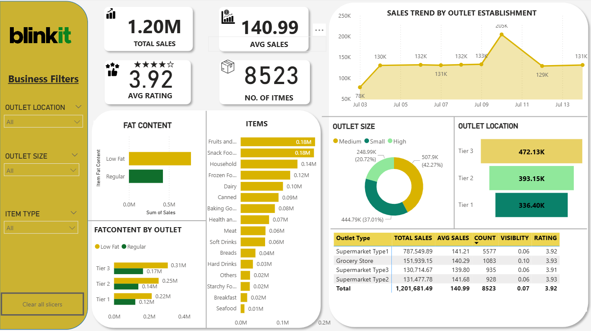

# Blinkit Sales Analysis 📊

## 📌 Project Overview
This project presents a comprehensive sales performance analysis of Blinkit retail outlets using Power BI. The dashboard provides business insights into sales trends, outlet performance, product categories, and customer preferences to support data-driven decision-making.

## 🎯 Business Objective
The objective of this project is to:
- Analyze overall sales performance across outlets
- Identify top-performing outlet tiers and sizes
- Evaluate category-wise revenue contribution
- Compare fat content sales distribution
- Track sales trends by outlet establishment year
- Monitor key KPIs such as average rating and item count
  
## 🛠 Tools & Technologies Used
- Power BI
- Git & GitHub

## 📂 Dataset Information
The dataset contains BlinkIT Grocery Data including:
- Item Fat Content
- Item Identifier
- Item Type
- Outlet Establishment Year
- Outlet Identifier
- Outlet Location Type
- Outlet Size
- Outlet Type
- Item Visiblity
- Item Weight
- Sales
- Rating
Total Records: 8523 rows

## 📊 Dashboard Features
- Interactive Business Filters (Outlet Location, Size, Item Type)
- KPI Cards for quick performance tracking
- Trend Line Analysis
- Category-wise Revenue Breakdown
- Donut & Bar Chart Visualizations
- Outlet Type Performance Comparison

## 🔍 Key Insights
- Identified highest sales by Outlet Location
- Found top performing Items
- Analyzed sales distribution on Outlet Size
- Analyzed Fat content by outlet

## 📸 Dashboard Preview

## 🚀 Conclusion
The analysis highlights key revenue drivers across outlet tiers, sizes, and product categories, with Tier 3 and high-size outlets contributing the highest sales. The dashboard enables strategic decision-making through clear KPI tracking and actionable retail performance insights.

## 👤 Author
Arun Yadav
